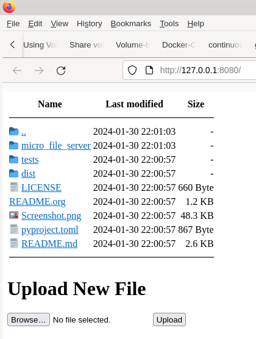

# Table of Contents

1.  [Description](#org123a450)
2.  [Features:](#org4e37874)
3.  [Dependencies](#org921980d)
4.  [Usage](#org5115948)
5.  [Screenshot](#org956c053)

-**- mode: Org; coding: utf-8; -**-

\#+TITLE micro-file-server

# Description

The micro autoindex and file hosting server with one Flask framework dependence.

This allow to transfer files between systems very easy and safely.

# Features:

-   ftp-like design
-   ability to uplaod file
-   protection from folder escaping and injecting
-   size calculation
-   configuration with enironmental variables
-   optional basic file type recognition: text, image, audio, video
-   optional ability to prevent downloading of small files to use browser as a text reader.

# Dependencies

Python version >= 3.10

Flask >= 2.3.2

Lower version may work as well.

# Usage

    export FLASK_RUN_HOST=0.0.0.0 FLASK_RUN_PORT=8080
    export FLASK_BASE_DIR='/home/user'
    flask --app main --no-debug run

Here is defaults, that you can change:

    export FLASK_FILENAME_MAX_LENGTH=40
    export FLASK_MIMETYPE_RECOGNITION=True
    export FLASK_SMALL_TEXT_DO_NOT_DOWNLOAD=True
    export FLASK_SMALL_TEXT_ENCODING="utf-8"
    export FLASK_FLASK_UPLOADING_ENABLED=True

# Screenshot

